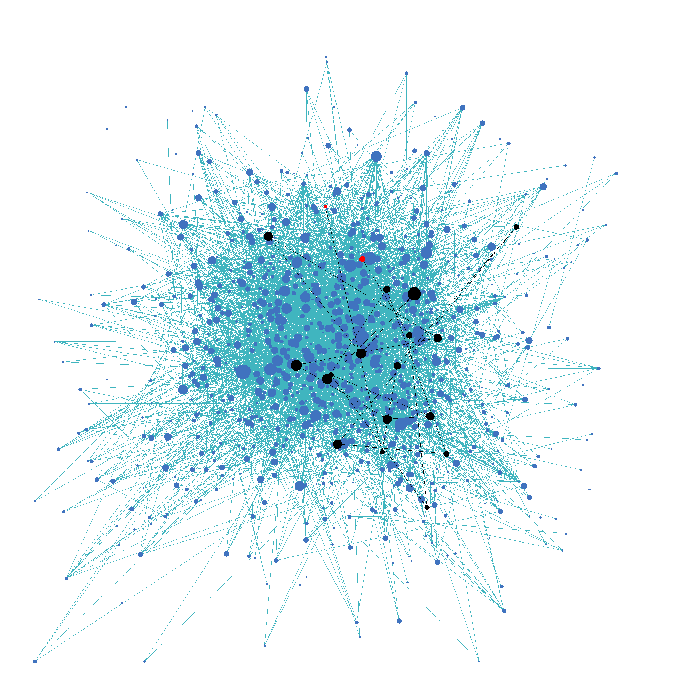

# Wiki-graph

## tslietz2-sohamk2-ttz2

Description

## Getting Started

### Compiled with

- clang 6.0.1
- Boost 1.53
- Qt 4.8.7

### Setting Up

1. Clone this repo and go to its directory.
   ```
   git clone https://github-dev.cs.illinois.edu/cs225-sp21/tslietz2-sohamk2-ttz2.git
   cd tslietz2-sohamk2-ttz2/
   ```
2. In a new directory, download the graph and name data from [Stanford's SNAP dataset of English Wikipedia in 2013](https://snap.stanford.edu/data/enwiki-2013.html) and extract them. Return to the main directory.
    ```
    mkdir data
    cd data/
    wget https://snap.stanford.edu/data/enwiki-2013.txt.gz 
    wget https://snap.stanford.edu/data/enwiki-2013-names.csv.gz
    gunzip *
    cd ../
    ```
3. You can decide from looking at `enwiki-2013-names.csv` what nodes you are interested in. Make the `prep-data` executable and use it to trim the data to include nodes of interest, while keeping the size reasonable.
    ```
    make prep-data
    Usage: ./prep-data from_node to_node data_input_path trimmed_output_path
    ```
4. Now you can make the `path` and `wiki-data` executables and use them like so:
    ```
    make path
    Usage: ./path trimmed_input_path type from_node to_node
    make wiki-graph
    Usage: ./wiki-graph trimmed_input_path output_path [from_node to_node]
    ```

### Example
1. This will prepare 1001 nodes related to math.
    ```
    ./prep-data 506500 507500 data/enwiki-2013.txt data/trimmed.txt
    ```

2. You can find an unweighted shortest path from [SymPy](https://en.wikipedia.org/wiki/SymPy) to [Graph theory](https://en.wikipedia.org/wiki/Graph_theory).
    ```
    make path
    ./path data/trimmed.txt 507232 506726
    ```
    This finds a path of length 3 going from [SymPy](https://en.wikipedia.org/wiki/SymPy), through [Polynomial long division](https://en.wikipedia.org/wiki/Polynomial_long_division) and [Algorithm](https://en.wikipedia.org/wiki/Algorithm), arriving at [Graph theory](https://en.wikipedia.org/wiki/Graph_theory).

3. You can also visualize this path in the graph.
    ```
    ./wiki-graph data/math.txt graph.png 507232 506726
    ```
    This outputs an image that looks like this: 

