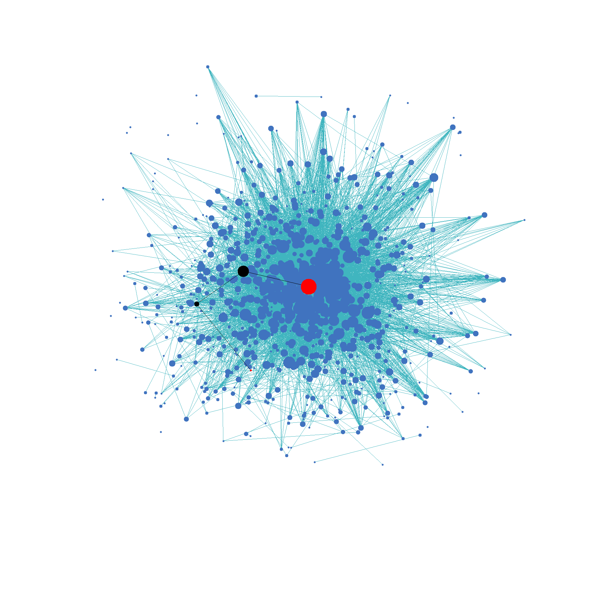

# Wiki-graph

## tslietz2-sohamk2-ttz2

Description TODO

## Executables

The following executables can be built and run:
- `prep-data` - arguments: `lower_node upper_node data_path output_path`
  - Trims the main dataset into a managable sized graph.
  - `lower_node` - The inclusive lower bound of node indices to be included in the graph represented by the output.
  - `upper_node` - The inclusive upper bound of node indices to be included in the graph represented by the output.
  - `data_path` - A text file in the format of [Stanford's SNAP dataset of English Wikipedia in 2013](https://snap.stanford.edu/data/enwiki-2013.html), with each line representing a directed edge that goes from the first node to the next. The two nodes of the edge are represented by two unsigned integer separated by a space.
  - `output_path` - The path of the file for the trimmed graph representation to be saved. Only edges with both endpoints within `[lower_node, uppernode]` are kept, and are written in the same format as the input file.
- `path` - arguments: `input_path from_node to_node [type]`
  - Outputs the shortest path and its length using Dijkstra's algorithm using target node's indegree as edge wieghts, as well as its length.
  - `input_path` - Path to a file generated by `prep-data`.
  - `from_node`, `to_node` - The starting and ending node indices for a shortest path search.
  - `type` (optional) - if this is `b` or `bfs`, an unwieghted shortest path will be found with a breadth-first search.
- `wiki-graph` - arguments: `input_path output_path [from_node to_node]`
  - Creates a visualization of a graph, with a shortest path highlighted if specified.
  - `input_path` - Path to a file generated by `prep-data`.
  - `output_path` - Path to save the PNG created by a force-based simulation of the graph. Nodes with higher indegree are larger.
  - `from_node`, `to_node` (optional, but must be together) - The starting and ending node indices for a shortest path search. If these are passed, the shortest path will be highlighted on the output image in black, with endpoints red.


## Directory Structure

- `apps` - command line applications to build
- `images` - force-based visualizations of graphs
- `src` - source files
  - `core` - core classes used by apps
  - `cs225` - code provided by CS225 MP's
  - `util` - utility functions 
- `tests` - test data and files

## Getting Started

### Compiled with

- clang 6.0.1
- Boost 1.53
- Qt 4.8.7

### Setting Up

1. Clone this repo and go to its directory.
   ```
   git clone https://github-dev.cs.illinois.edu/cs225-sp21/tslietz2-sohamk2-ttz2.git
   cd tslietz2-sohamk2-ttz2/
   ```
2. In a new directory, download the graph and name data from [Stanford's SNAP dataset of English Wikipedia in 2013](https://snap.stanford.edu/data/enwiki-2013.html) and extract them. Return to the main directory.
    ```
    mkdir data
    cd data/
    wget https://snap.stanford.edu/data/enwiki-2013.txt.gz 
    wget https://snap.stanford.edu/data/enwiki-2013-names.csv.gz
    gunzip *
    cd ../
    ```
3. You can decide from looking at `enwiki-2013-names.csv` what nodes you are interested in. Make the `prep-data` executable and use it to trim the data to include nodes of interest, while keeping the size reasonable.
    ```
    make prep-data
    Usage: ./prep-data lower_node upper_node data_path output_path
    ```
4. Now you can make the `path` and `wiki-data` executables and use them like so:
    ```
    make path
    Usage: ./path input_path from_node to_node [type]
    make wiki-graph
    Usage: ./wiki-graph trimmed_input_path output_path [from_node to_node]
    ```

### Example
1. This will prepare 1001 nodes related to math.
    ```
    ./prep-data 506500 507500 data/enwiki-2013.txt data/trimmed.txt
    ```

2. You can find an unweighted shortest path from [SymPy](https://en.wikipedia.org/wiki/SymPy) to [Graph theory](https://en.wikipedia.org/wiki/Graph_theory).
    ```
    ./path data/trimmed.txt 507232 506726 bfs
    ```
    This finds a path of length 3 going from [SymPy](https://en.wikipedia.org/wiki/SymPy), through [Polynomial long division](https://en.wikipedia.org/wiki/Polynomial_long_division) and [Algorithm](https://en.wikipedia.org/wiki/Algorithm), arriving at [Graph theory](https://en.wikipedia.org/wiki/Graph_theory).

3. You can also visualize this path in the graph.
    ```
    ./wiki-graph data/trimmed.txt graph.png 507232 506726
    ```
    This outputs an image that looks like this: 

## Testing
Along with our project we have a test suite. You can build and run it with the following commands:
```
make test
./test
```
The data used for testing can be found in the [tests](tests) folder. Functionalities tested include:
- Graph loaded from a file has correct nodes, neighbors, and indegrees.
- Unweighted shortest path algorithm
- Dijkstra's shortest path algorithm
