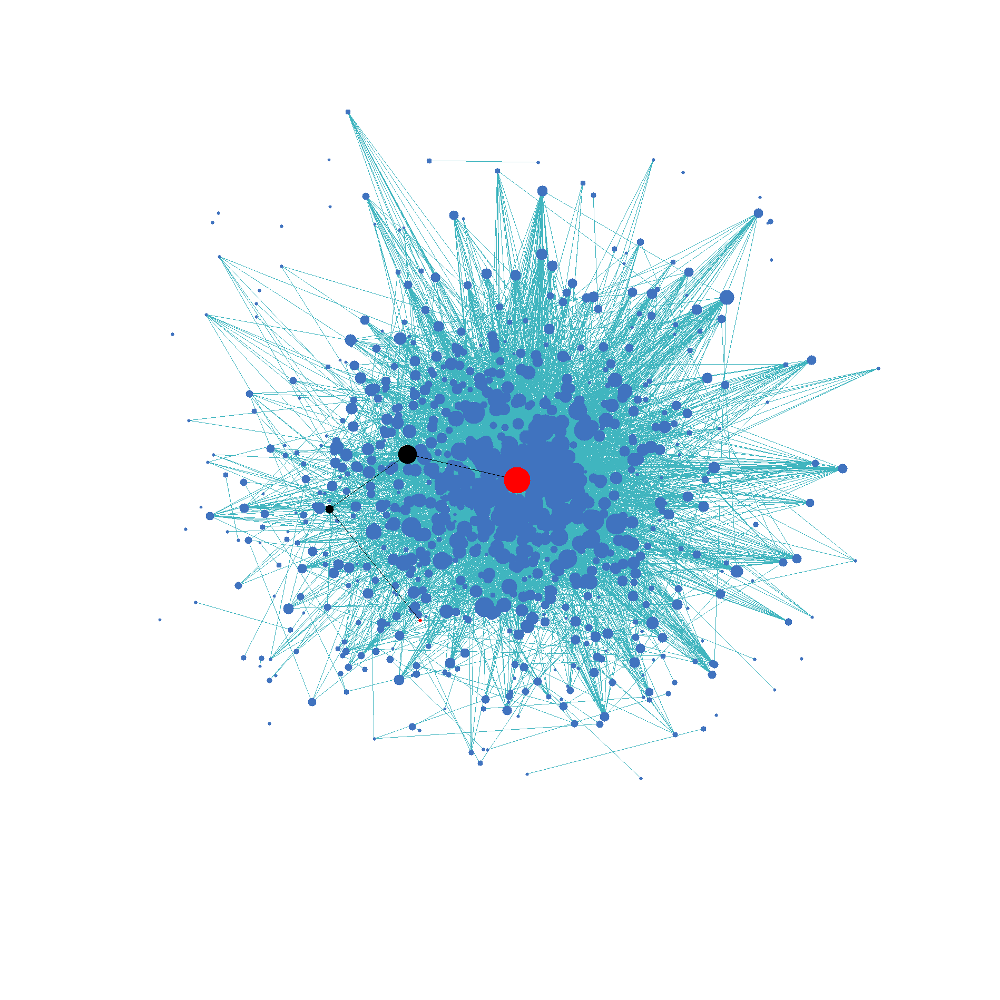

# Results

## Leading Question

How could we visualize the relationship between articles on Wikipedia? 

## Our Approach

We decided to answer this question using two methods

### Shortest Path

- Breadth First Search (BFS): Using BFS, we were able to find the shortest path between two nodes, 
which provided us a relationship between two articles based on their hyperlinks

- Djikstra's Shortest Path algorithm: Using an indegree heuristic to weigh our dataset, we were able to produce paths with normalized similarity.  
This meant that nodes that were highly referenced (such as calendar years) did not dominate our paths, and produced more meaningful and unique relationships.

### Force Based Visualization

Visualizing our data set was a key part of understanding it. 
For this, we used a physics based approach with nodes treated as particles with attractive and repulsive forces based on the edges. 
We optimized our algorithm using K-Dimensional trees for searching particles within a given range.

We observed that 
- Nodes with more edges were towards the center
- Nodes that were less well connected were towards the edges
- Wikipedia is quite a dense graph

Our implementation was based on [this paper](https://cs.brown.edu/people/rtamassi/gdhandbook/chapters/force-directed.pdf).

